#  PBlossom 
**Ancient Wisdom, Modern Elegance**

PBlossom 是一款将传统易理逻辑与现代数字化技术相结合的探索工具。我们致力于通过代码重构复杂的计算模型，让普通用户也能通过AI解读玄学结果，零门槛接触千年智慧。

## 开始使用
- **网页**：https://pblossom.onrender.com/
- **小程序**：微信搜索 **PBlossom**
- **本地使用**：https://github.com/WJSGZZ/PBlossom/releases

## 新特性
- v2.6：新增**六壬**排盘功能 (Beta)

## 功能简介
- **新占** (Xinzhan/Divination)：实现了梅花易数起卦与逻辑分析功能，支持自动推演本、互、变三卦及其与年月日时干支的生克关系。
- **六壬** (Liuren)：六壬排盘功能，支持真太阳时修正、天地盘、四课三传完整推演。
- **往昔** (Wangxi/History)：内置本地化存储，提供带防误触逻辑的交互式历史记录管理，梅花与六壬记录统一管理。
- **时令** (Shiling/Ganzhi)：查询日期所对应干支的万年历功能，支持真太阳时校准。
- **常见问题** (FAQ)：内置建议说明与使用指南，帮助小白快速了解与上手。

## 界面展示
### 网页端 (Web)

  <figure>
    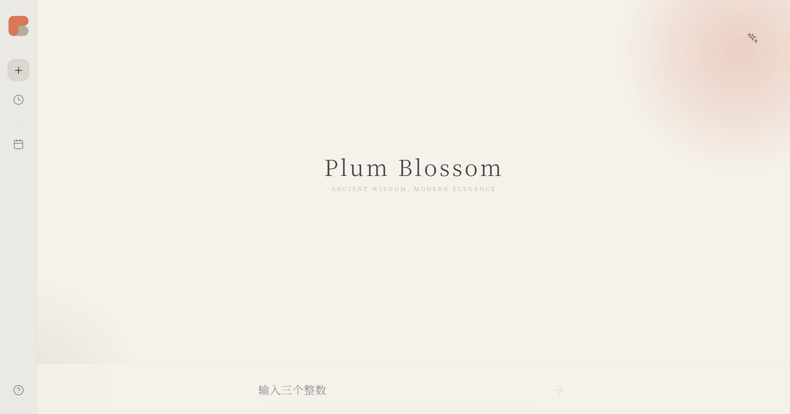
    
新占 (Divination)

  </figure>

  <figure>
    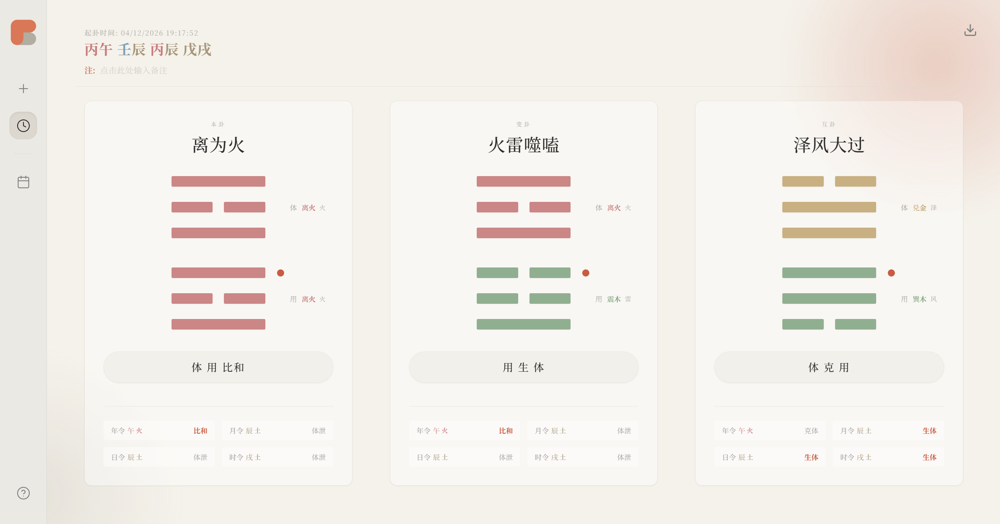
    
梅花结果页 (Meihua Result)

  </figure>

  <figure>
    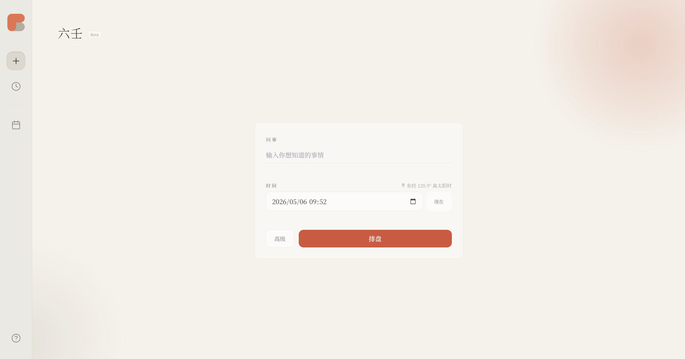
    
六壬 (Liuren)

  </figure>

  <figure>
    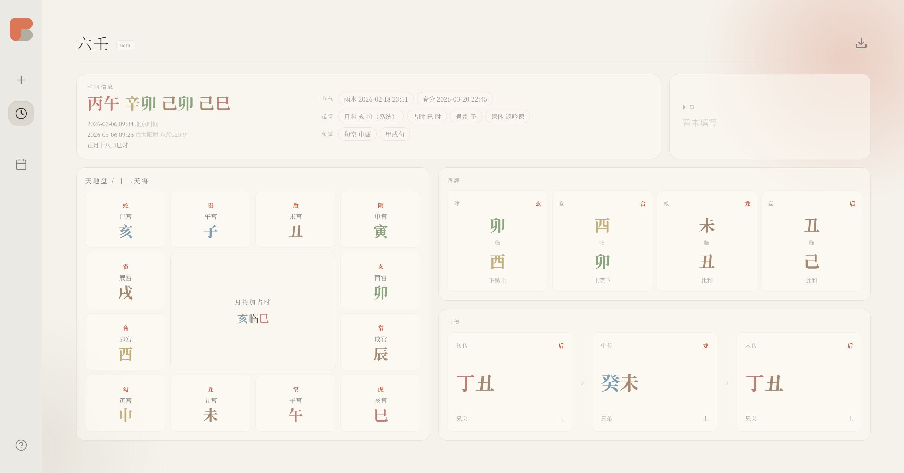
    
六壬结果页 (Liuren Result)

  </figure>

  <figure>
    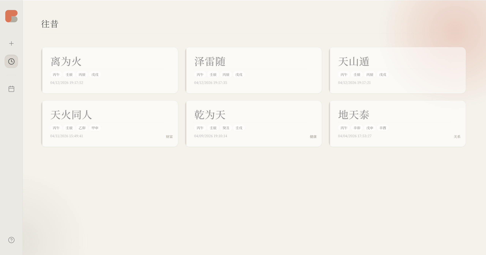
    
往昔 (History)

  </figure>

  <figure>
    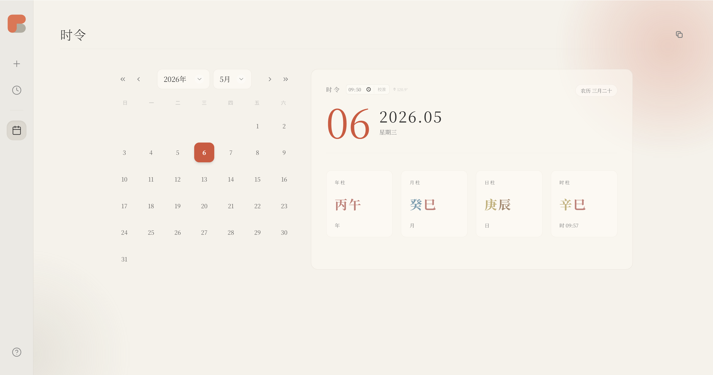
    
时令 (Calendar)

  </figure>

  <figure>
    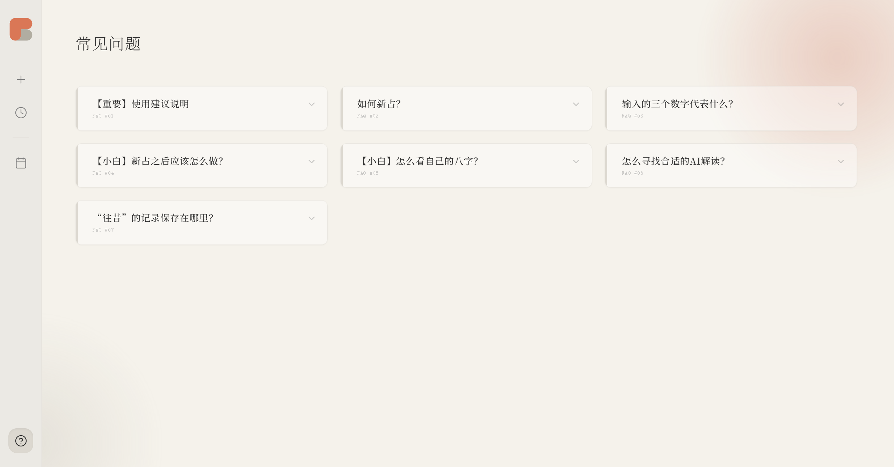
    
常见问题 (FAQ)

  </figure>

### 小程序 (MiniProgram)

<table>
  <tr>
    <td align="center">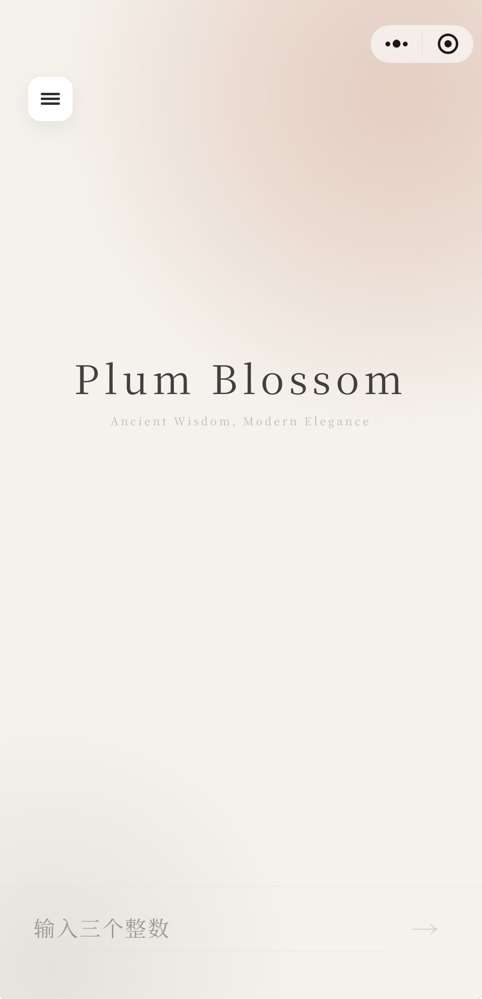 新占</td>
    <td align="center">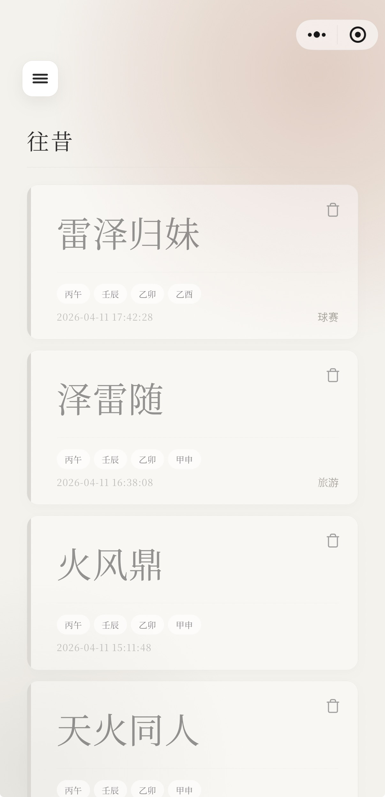 往昔</td>
    <td align="center">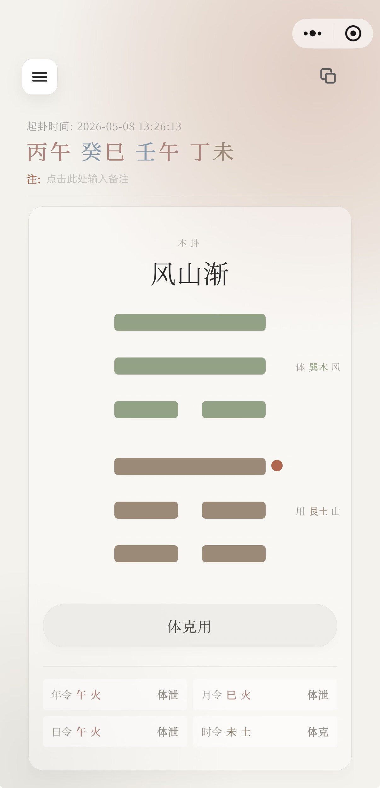 结果页</td>
    <td align="center">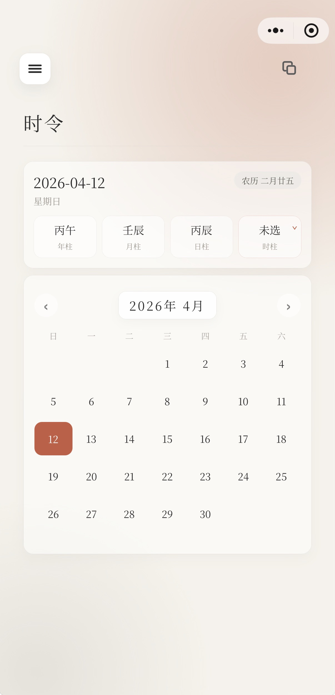 时令</td>
    <td align="center"> 常见问题</td>
  </tr>
</table>

- **深色模式**：在深邃的黑暗中找到真实的自己

<table>
  <tr>
    <td align="center">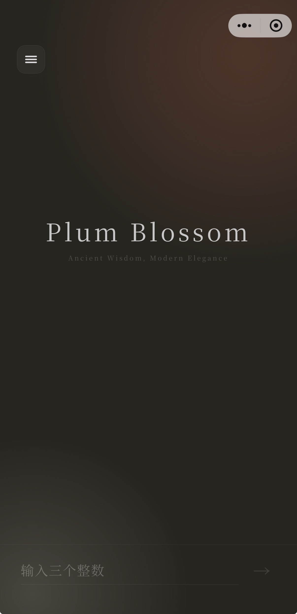</td>
    <td align="center">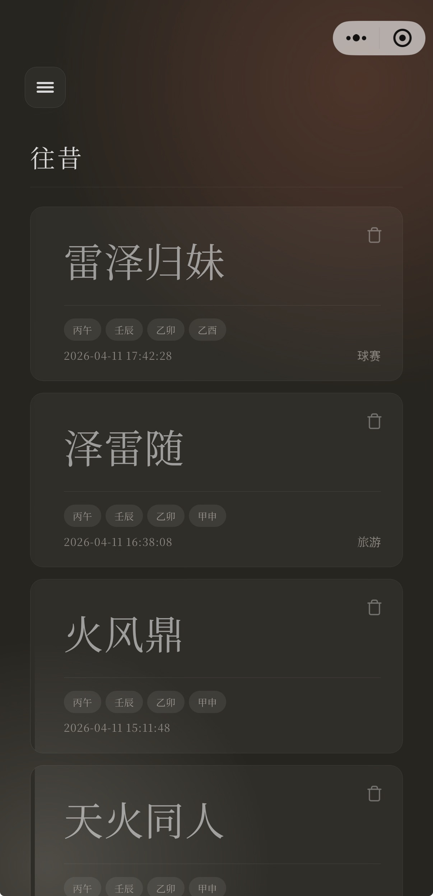</td>
    <td align="center">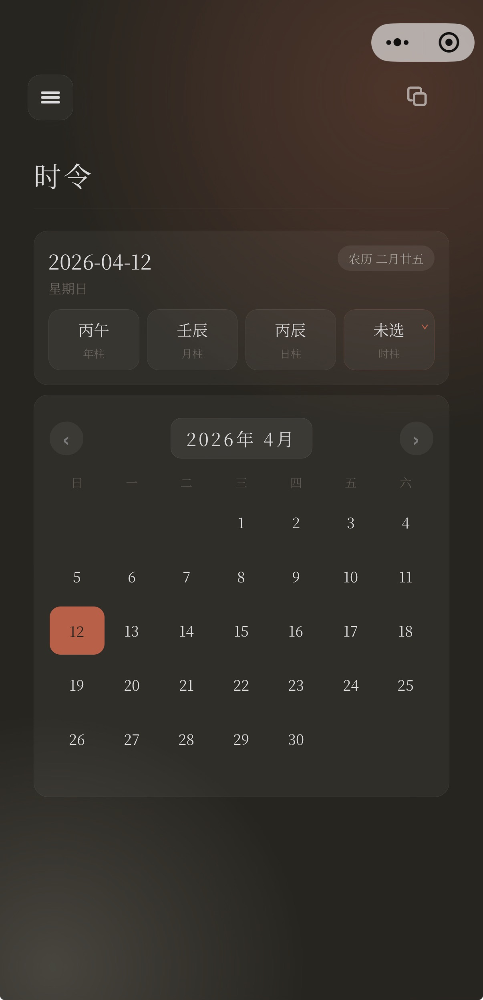</td>
    <td align="center"></td>
    <td align="center">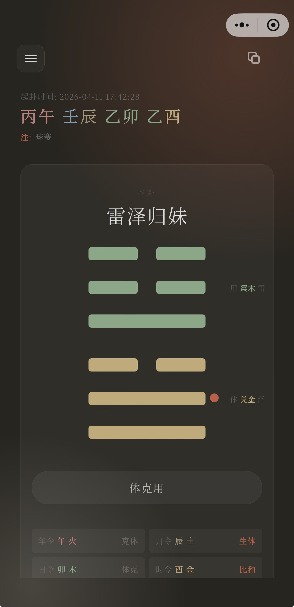</td>
  </tr>
  <tr>
    <td colspan="5" align="center">深色模式</td>
  </tr>
</table>

## 名称来源
PBlossom是Plum Blossom(梅花)的简写，来源于“梅花易数”。

## Logo设计
Logo实际上是一个珊瑚橙(#DA7756)的“P”与灰褐色(#B1ADA1)的“B”上下重叠在一起，代表着Plum Blossom(梅花)。

  <figure>
    
    
Logo

  </figure>

## 温馨提示
目前市面上最强的AI在玄学/神秘学领域犯错的几率在50%左右。**请勿过分相信AI给出的结果！**
